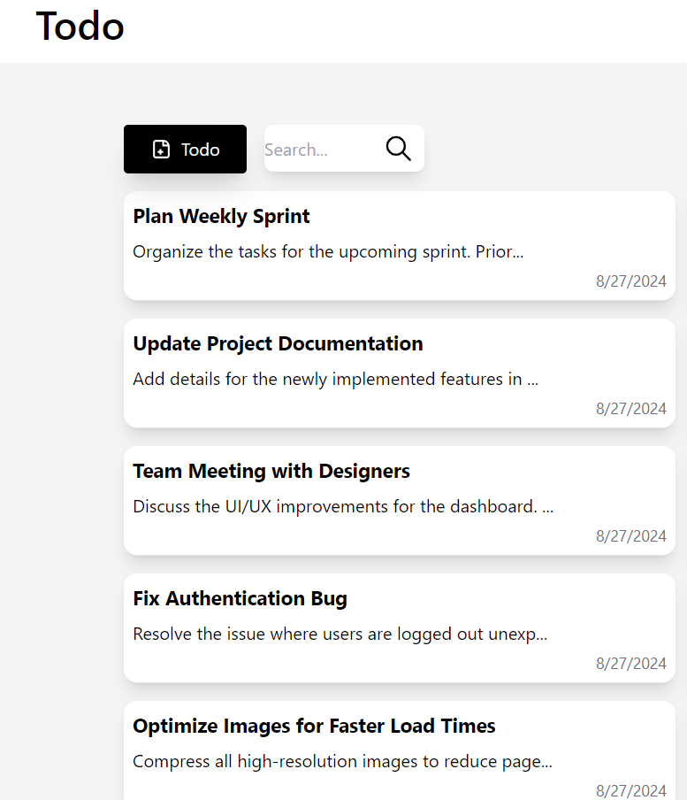
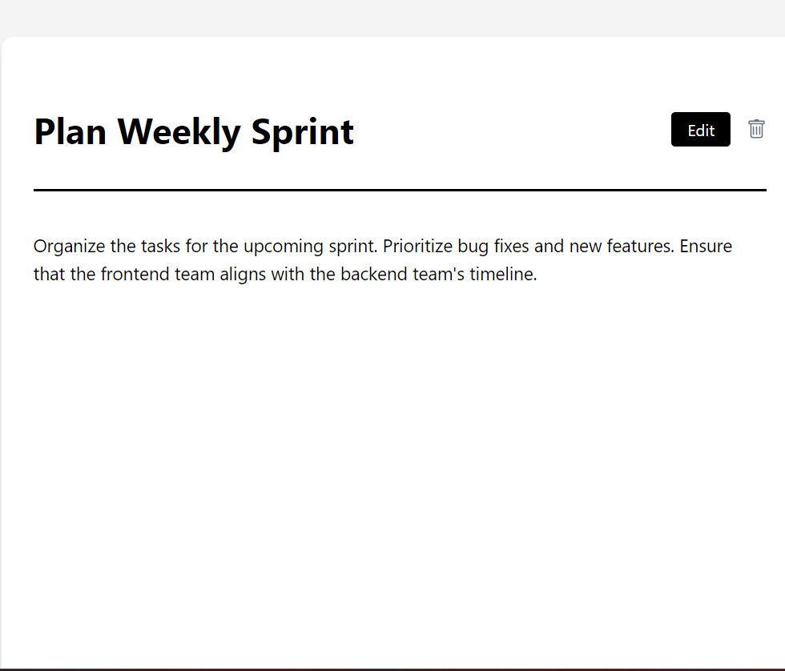
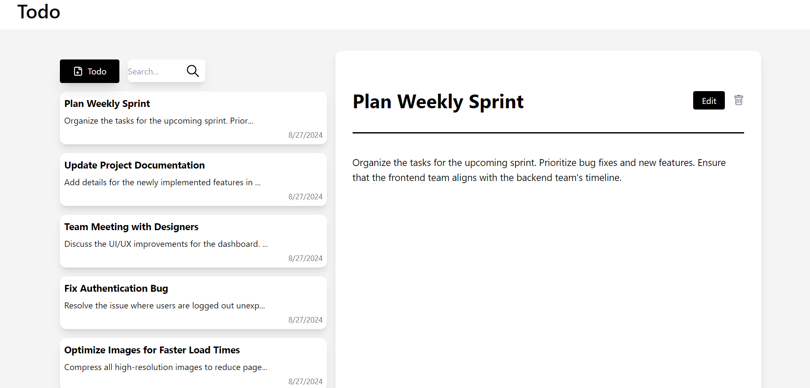
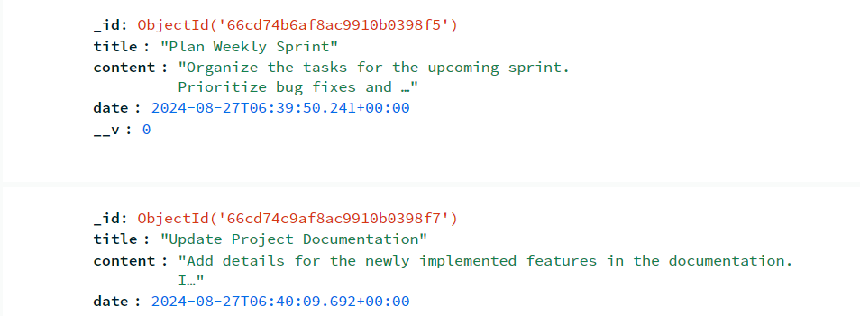

# Todo App

A full-featured Todo application built with Next.js, Node.js, Express, and MongoDB. This application allows users to create, view, edit, and delete their todos. It provides a simple and responsive user interface to manage tasks effectively.

## Features

- **Add Todos**: Users can add new tasks by providing a title and content.
- **Update Todos**: Users can edit their existing tasks.
- **Delete Todos**: Users can remove tasks they no longer need.
- **Search Todos**: A search functionality to filter tasks based on title or content.
- **Responsive Design**: The app is fully responsive, displaying only the list of todos on smaller screens, with task details shown when a todo is clicked.

## Tech Stack

- **Frontend**: Next.js, Tailwind CSS , Axios 
- **Backend**: Node.js, Express.js
- **Database**: MongoDB
- **Icons**: React Icons

## Installation

1. Clone the repository:
   ```bash
   git clone https://github.com/yourusername/todo-app.git
   cd todo-app

2. Install dependencies for both the frontend and backend:
   ```bash
   cd todo-backend
   npm install
   cd ../todo-frontend
   npm install


3. Set up a MongoDB database and update the backend's .env file with the connection string.
   
4. Start the backend server:
   ```bash
   cd todo-backend
   node server.js

5. Start the frontend server:
   ```bash
   cd ../todo-frontend
   npm run dev

## Screenshots

### Todo List



### Todo Details



### Full App View



### Database View


   
   
   
   
   
    
